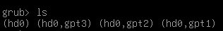

本次实验使用 VirtualBox + Ubuntu20.04

### 困难点

#### 1. 启动时不会进入 grub 选择页面

需要设置 `/etc/default/grub`，然后执行 `update-grub`

```
GRUB_DEFAULT=0
#GRUB_TIMEOUT_STYLE=hidden # 需注释掉
#GRUB_TIMEOUT=10 # 不能为 0
GRUB_DISTRIBUTOR=`lsb_release -i -s 2> /dev/null || echo Debian`
GRUB_CMDLINE_LINUX_DEFAULT="text"
GRUB_CMDLINE_LINUX=""
```


#### 2. /boot 目录挂载的分区

教程中在 `/boot/grub/grub.cfg` 中是这样设置：

```
menuentry 'HelloOS' {
	insmod part_msdos # GRUB 加载分区模块识别分区
	insmod ext2 # GRUB 加载 ext 文件系统模块识别 ext 文件系统
	set root='hd0,msdos4' # boot 目录挂载的分区，不同机器不同情况
	multiboot2 /boot/HelloOS.bin # GRUB 以 multiboot2 协议加载 HelloOS.bin
	boot # GRUB 启动 HelloOS.bin
}
```

但我使用 Ubuntu 20.04，显示的是 gpt，在 grub 命令行中为：



而在 `ls (hd0,gpt2)/`下找到 `HelloOS.bin`文件：


则最终的 `/boot/grub/grub.cfg`中设置为：

```
menuentry 'HelloOS' {
	insmod part_gpt # 改成 part_gpt
	insmod ext2
	set root='hd0,gpt2' # boot 目录挂载的分区，本次实验改成 gpt2
	multiboot2 /HelloOS.bin # 没有 /boot 父目录
	boot
}
```


